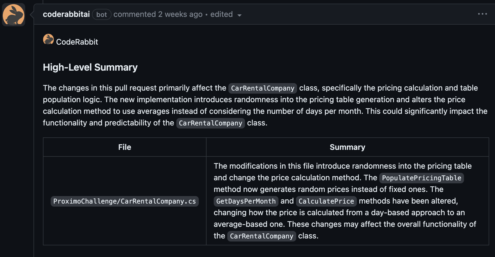
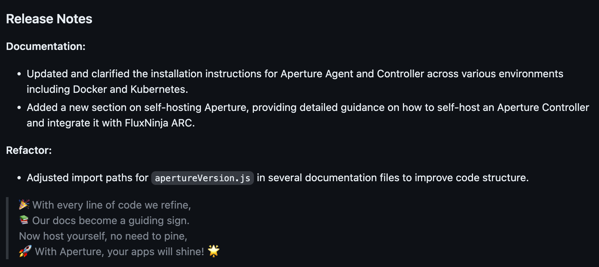
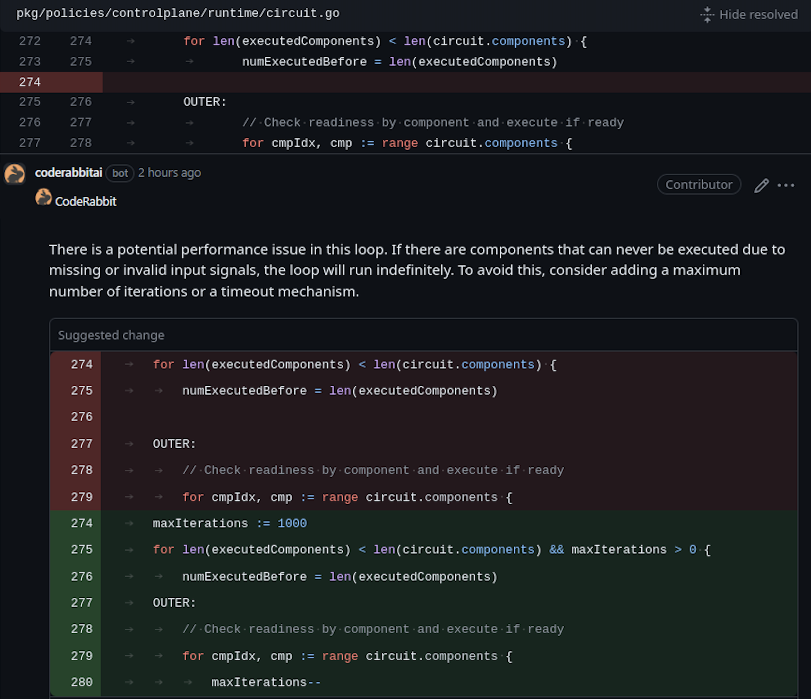
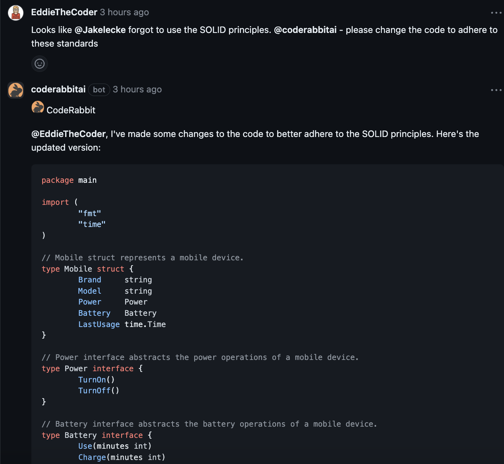

# CodeRabbit Pro

This is an old version of [CodeRabbit](http://coderabbit.ai) and is now in the maintenance mode.
We recommend installing the Pro version from [CodeRabbit](http://coderabbit.ai). The Pro version is a total redesign and offers significantly better reviews that learn from your usage and improve over time. CodeRabbit Pro is free for open source projects. 

[](https://discord.gg/GsXnASn26c)

# AI-based PR reviewer and summarizer

[](https://opensource.org/licenses/MIT)
[](https://github.com/coderabbitai/ai-pr-reviewer/commits/main)

## Overview

CodeRabbit `ai-pr-reviewer` is an AI-based code reviewer and summarizer for
GitHub pull requests using OpenAI's `gpt-3.5-turbo` and `gpt-4` models. It is
designed to be used as a GitHub Action and can be configured to run on every
pull request and review comments

## Reviewer Features:

- **PR Summarization**: It generates a summary and release notes of the changes
  in the pull request.
- **Line-by-line code change suggestions**: Reviews the changes line by line and
  provides code change suggestions.
- **Continuous, incremental reviews**: Reviews are performed on each commit
  within a pull request, rather than a one-time review on the entire pull
  request.
- **Cost-effective and reduced noise**: Incremental reviews save on OpenAI costs
  and reduce noise by tracking changed files between commits and the base of the
  pull request.
- **"Light" model for summary**: Designed to be used with a "light"
  summarization model (e.g. `gpt-3.5-turbo`) and a "heavy" review model (e.g.
  `gpt-4`). _For best results, use `gpt-4` as the "heavy" model, as thorough
  code review needs strong reasoning abilities._
- **Chat with bot**: Supports conversation with the bot in the context of lines
  of code or entire files, useful for providing context, generating test cases,
  and reducing code complexity.
- **Smart review skipping**: By default, skips in-depth review for simple
  changes (e.g. typo fixes) and when changes look good for the most part. It can
  be disabled by setting `review_simple_changes` and `review_comment_lgtm` to
  `true`.
- **Customizable prompts**: Tailor the `system_message`, `summarize`, and
  `summarize_release_notes` prompts to focus on specific aspects of the review
  process or even change the review objective.

To use this tool, you need to add the provided YAML file to your repository and
configure the required environment variables, such as `GITHUB_TOKEN` and
`OPENAI_API_KEY`. For more information on usage, examples, contributing, and
FAQs, you can refer to the sections below.

- [Overview](#overview)
- [Professional Version of CodeRabbit](#professional-version-of-coderabbit)
- [Reviewer Features](#reviewer-features)
- [Install instructions](#install-instructions)
- [Conversation with CodeRabbit](#conversation-with-coderabbit)
- [Examples](#examples)
- [Contribute](#contribute)
- [FAQs](#faqs)


## Install instructions

`ai-pr-reviewer` runs as a GitHub Action. Add the below file to your repository
at `.github/workflows/ai-pr-reviewer.yml`

```yaml
name: Code Review

permissions:
  contents: read
  pull-requests: write

on:
  pull_request:
  pull_request_review_comment:
    types: [created]

concurrency:
  group:
    ${{ github.repository }}-${{ github.event.number || github.head_ref ||
    github.sha }}-${{ github.workflow }}-${{ github.event_name ==
    'pull_request_review_comment' && 'pr_comment' || 'pr' }}
  cancel-in-progress: ${{ github.event_name != 'pull_request_review_comment' }}

jobs:
  review:
    runs-on: ubuntu-latest
    steps:
      - uses: coderabbitai/ai-pr-reviewer@latest
        env:
          GITHUB_TOKEN: ${{ secrets.GITHUB_TOKEN }}
          OPENAI_API_KEY: ${{ secrets.OPENAI_API_KEY }}
        with:
          debug: false
          review_simple_changes: false
          review_comment_lgtm: false
```

#### Environment variables

- `GITHUB_TOKEN`: This should already be available to the GitHub Action
  environment. This is used to add comments to the pull request.
- `OPENAI_API_KEY`: use this to authenticate with OpenAI API. You can get one
  [here](https://platform.openai.com/account/api-keys). Please add this key to
  your GitHub Action secrets.
- `OPENAI_API_ORG`: (optional) use this to use the specified organization with
  OpenAI API if you have multiple. Please add this key to your GitHub Action
  secrets.

### Models: `gpt-4` and `gpt-3.5-turbo`

Recommend using `gpt-3.5-turbo` for lighter tasks such as summarizing the
changes (`openai_light_model` in configuration) and `gpt-4` for more complex
review and commenting tasks (`openai_heavy_model` in configuration).

Costs: `gpt-3.5-turbo` is dirt cheap. `gpt-4` is orders of magnitude more
expensive, but the results are vastly superior. We are typically spending $20 a
day for a 20 developer team with `gpt-4` based review and commenting.

### Prompts & Configuration

See: [action.yml](./action.yml)

Tip: You can change the bot personality by configuring the `system_message`
value. For example, to review docs/blog posts, you can use the following prompt:

<details>
<summary>Blog Reviewer Prompt</summary>

```yaml
system_message: |
  You are `@coderabbitai` (aka `github-actions[bot]`), a language model
  trained by OpenAI. Your purpose is to act as a highly experienced
  DevRel (developer relations) professional with focus on cloud-native
  infrastructure.

  Company context -
  CodeRabbit is an AI-powered Code reviewer.It boosts code quality and cuts manual effort. Offers context-aware, line-by-line feedback, highlights critical changes,
  enables bot interaction, and lets you commit suggestions directly from GitHub.

  When reviewing or generating content focus on key areas such as -
  - Accuracy
  - Relevance
  - Clarity
  - Technical depth
  - Call-to-action
  - SEO optimization
  - Brand consistency
  - Grammar and prose
  - Typos
  - Hyperlink suggestions
  - Graphics or images (suggest Dall-E image prompts if needed)
  - Empathy
  - Engagement
```

</details>

## Conversation with CodeRabbit

You can reply to a review comment made by this action and get a response based
on the diff context. Additionally, you can invite the bot to a conversation by
tagging it in the comment (`@coderabbitai`).

Example:

> @coderabbitai Please generate a test plan for this file.

Note: A review comment is a comment made on a diff or a file in the pull
request.

### Ignoring PRs

Sometimes it is useful to ignore a PR. For example, if you are using this action
to review documentation, you can ignore PRs that only change the documentation.
To ignore a PR, add the following keyword in the PR description:

```text
@coderabbitai: ignore
```

## Examples

Some of the reviews done by ai-pr-reviewer









Any suggestions or pull requests for improving the prompts are highly
appreciated.

## Contribute

### Developing

> First, you'll need to have a reasonably modern version of `node` handy, tested
> with node 17+.

Install the dependencies

```bash
$ npm install
```

Build the typescript and package it for distribution

```bash
$ npm run build && npm run package
```

## FAQs

### Review pull requests from forks

GitHub Actions limits the access of secrets from forked repositories. To enable
this feature, you need to use the `pull_request_target` event instead of
`pull_request` in your workflow file. Note that with `pull_request_target`, you
need extra configuration to ensure checking out the right commit:

```yaml
name: Code Review

permissions:
  contents: read
  pull-requests: write

on:
  pull_request_target:
    types: [opened, synchronize, reopened]
  pull_request_review_comment:
    types: [created]

concurrency:
  group:
    ${{ github.repository }}-${{ github.event.number || github.head_ref ||
    github.sha }}-${{ github.workflow }}-${{ github.event_name ==
    'pull_request_review_comment' && 'pr_comment' || 'pr' }}
  cancel-in-progress: ${{ github.event_name != 'pull_request_review_comment' }}

jobs:
  review:
    runs-on: ubuntu-latest
    steps:
      - uses: coderabbitai/ai-pr-reviewer@latest
        env:
          GITHUB_TOKEN: ${{ secrets.GITHUB_TOKEN }}
          OPENAI_API_KEY: ${{ secrets.OPENAI_API_KEY }}
        with:
          debug: false
          review_simple_changes: false
          review_comment_lgtm: false
```

See also:
https://docs.github.com/en/actions/using-workflows/events-that-trigger-workflows#pull_request_target

### Inspect the messages between OpenAI server

Set `debug: true` in the workflow file to enable debug mode, which will show the
messages

### Disclaimer

- Your code (files, diff, PR title/description) will be sent to OpenAI's servers
  for processing. Please check with your compliance team before using this on
  your private code repositories.
- OpenAI's API is used instead of ChatGPT session on their portal. OpenAI API
  has a
  [more conservative data usage policy](https://openai.com/policies/api-data-usage-policies)
  compared to their ChatGPT offering.
- This action is not affiliated with OpenAI.
