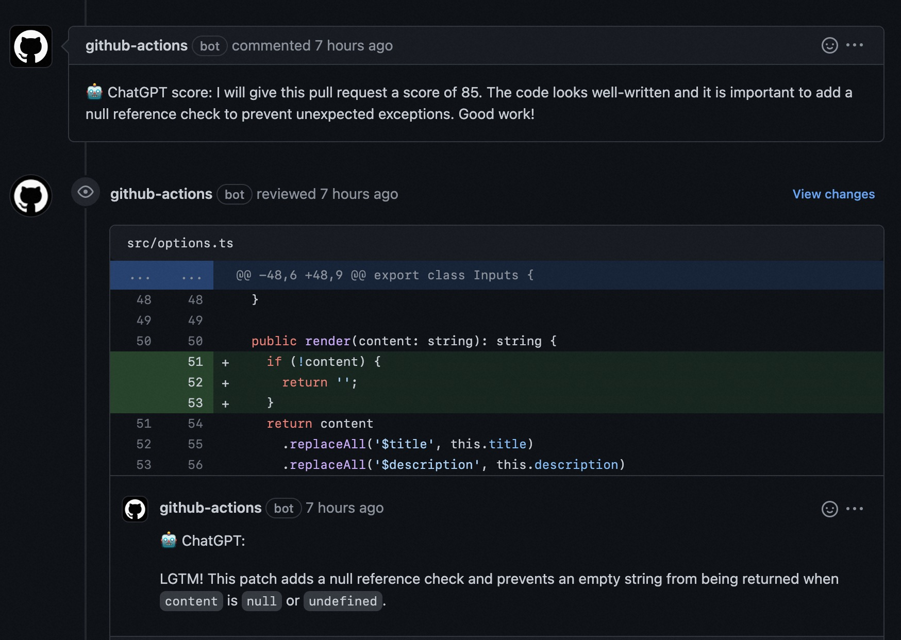

# ChatGPT actions

A collection of ChatGPT assistants, e.g., code viewer, labeler, assigner, etc.

- [Overview](#overview)
  - [Why reinvent the wheel?](#why-reinvent-the-wheel)
  - [Features](#features)
- [Usage](#usage)
  - [Configuration](#configuration)
    - [Environment variables](#environment-variables)
    - [Inputs](#inputs)
  - [Prompt templates](#prompt-templates)
    - [Variables available in prompt templates](#variables-available-in-prompt-templates)
- [Developing](#developing)
- [FAQs](#faqs)
  - [Review pull request from forks](#review-pull-request-from-forks)
  - [Choose the ChatGPT API implementation](#choose-the-chatgpt-api-implementation)
  - [Inspect the messages between ChatGPT server](#inspect-the-messages-between-chatgpt-server)
- [License](#license)



## Overview

### Why reinvent the wheel?

There're already many [chatgpt-actions][1], why we need to reinvent the wheel?

- Code review is not pull request changeset summarization

  Some of existing actions send the whole pull request diff to ChatGPT, and
  ask ChatGPT to summarize the pull request, or summarize each hunks. In
  practice, the summarize has already done by the proposer and the code reviewer
  is responsible for reviewing the changes, evaluate the quality, and decide
  whether to merge the pull request.

  **This action has a "score" action that asks ChatGPT to score the pull request,
  and give a short comment as a explanation. That should be a "good hint" when
  starting a code review.**

- Leave too much comments on Github pull requests

  Some of existing actions send each hunks in a pull request diff to ChatGPT,
  and yields a comment (or comment snippet) for each hunk. That makes them in
  practically unusable, as receiving 20+ email notification after submitting
  a pull request is not a good experience. For the reviewer's perspective, we
  usually just focus on the hunks that are "too good" or "too bad".

  **This actions take such experience into consideration, and only leave comments
  for the hunks that are not "LGTM".** (We do have an option to leave comments
  for good hunks as well).

- Lack of customization of the prompt

  All of existing actions hard-coded the prompt template inside the source code
  and there's no chance to customize the prompt. When the built-in prompt is
  not good enough, ChatGPT responses with useless comments.

  At the same time, someone may have good prompt ideas, he/she want to try using
  ChatGPT as an AI assistant for code quality evaluation and review, but he/she
  needs to reinvent the wheel for a new action to play on Github.

  **This action makes the prompt template configurable.** With a set of variables
  like `$title`, `$description`, `$filename`, `$patch`, you can customize the
  message sent to ChatGPT for better experience.

  Prompt engineering is an _art_ to make ChatGPT success, we encourage the community
  to try discovering new, novel, and insightful prompts to make ChatGPT do
  code review job better, _**without reinventing the wheel for another chatgpt-action**_.

  **ANY SUGGESTIONS AND IMPROVEMENTS ARE HIGHLY APPRECIATED!!!**

### Features

- Scoring your pull requests

  ```yaml
      - uses: unsafecoerce/chatgpt-action@main
        env:
          GITHUB_TOKEN: ${{ secrets.GITHUB_TOKEN }}
          CHATGPT_ACCESS_TOKEN: ${{ secrets.CHATGPT_ACCESS_TOKEN }}
          OPENAI_API_KEY: ${{ secrets.OPENAI_API_KEY }}
        with:
          debug: false
          action: score
  ```

- Code review your pull requests

  ```yaml
      - uses: unsafecoerce/chatgpt-action@main
        env:
          GITHUB_TOKEN: ${{ secrets.GITHUB_TOKEN }}
          CHATGPT_ACCESS_TOKEN: ${{ secrets.CHATGPT_ACCESS_TOKEN }}
          OPENAI_API_KEY: ${{ secrets.OPENAI_API_KEY }}
        with:
          debug: false
          action: review
          review_comment_lgtm: true
  ```

- Customizable prompt templates

  ```yaml
      - uses: unsafecoerce/chatgpt-action@main
        env:
          GITHUB_TOKEN: ${{ secrets.GITHUB_TOKEN }}
          CHATGPT_ACCESS_TOKEN: ${{ secrets.CHATGPT_ACCESS_TOKEN }}
          OPENAI_API_KEY: ${{ secrets.OPENAI_API_KEY }}
        with:
          debug: false
          action: score
          scoring_beginning: |
            Hi ChatGPT, I have a pull request with title "$title" and the description is as follows,

            > $description

            I would like to give you the whole diff of the pull request and you need to given a score after
            reviewing the pull request. The score should be a number between 0 and 100 and 85 means the
            the pull request is basically acceptable. You just need to reply a number between 0 and 100,
            e.g., "85", and a comment within 30 words. Reply "OK" to confirm.
  ```

## Usage

```yaml
name: Code Review

permissions:
  contents: read
  pull-requests: write

on:
  pull_request:

jobs:
  test:
    runs-on: ubuntu-latest
    steps:
      - uses: actions/checkout@v3
        with:
          repository: ${{github.event.pull_request.head.repo.full_name}}
          ref: ${{github.event.pull_request.head.ref}}
          submodules: false

      - uses: unsafecoerce/chatgpt-action@main
        env:
          GITHUB_TOKEN: ${{ secrets.GITHUB_TOKEN }}
          CHATGPT_ACCESS_TOKEN: ${{ secrets.CHATGPT_ACCESS_TOKEN }}
          OPENAI_API_KEY: ${{ secrets.OPENAI_API_KEY }}
        with:
          debug: false
          action: score

      - uses: unsafecoerce/chatgpt-action@main
        env:
          GITHUB_TOKEN: ${{ secrets.GITHUB_TOKEN }}
          CHATGPT_ACCESS_TOKEN: ${{ secrets.CHATGPT_ACCESS_TOKEN }}
          OPENAI_API_KEY: ${{ secrets.OPENAI_API_KEY }}
        with:
          debug: false
          action: review
          review_comment_lgtm: true
```

### Configuration

See also: [./action.yml](./action.yml)

#### Environment variables

- `GITHUB_TOKEN`
- `CHATGPT_ACCESS_TOKEN`: ChatGPT access token, see also: https://github.com/acheong08/ChatGPT.

  The access token can be easily obtained from https://chat.openai.com/api/auth/session after
  logging into ChatGPT.

- `OPENAI_API_KEY`: use this to authenticate with OpenAI API, official ChatGPT's behavior using
  `text-davinci-003`, see also: https://github.com/transitive-bullshit/chatgpt-api

Note that `CHATGPT_ACCESS_TOKEN` and `OPENAI_API_KEY` are not both required. Inside this action,
unofficial ChatGPT is preferred if `CHATGPT_ACCESS_TOKEN` exists. Note that the `CHATGPT_ACCESS_TOKEN`
can expire frequently, so `OPENAI_API_KEY` should be more convenient if its cost is affordable
to you.

#### Inputs

- `action`: The action to run, currently can be `review`, `score`
- `debug`: Enable debug mode, will show messages and responses between ChatGPT server in CI logs.
- `chatgpt_reverse_proxy`: The URL of the ChatGPT reverse proxy
- `review_comment_lgtm`: Leave comments even the patch is LGTM
- `path_filters`: Rules to filter files to be reviewed.

### Prompt templates:

See also: [./action.yml](./action.yml)

- `review_beginning`: The beginning prompt of a code review dialog
- `review_patch`: The prompt for each chunks/patches
- `scoring_beginning`: The beginning prompt for scoring a pull request
- `scoring`: The prompt for the whole pull request

#### Variables available in prompt templates

- pull request score (`action: score`):

  - `$title`: Title of the pull requests.
  - `$description`: The description of the pull request.
  - `$diff`: The whole diff of the pull request.

- code review (`action: review`):

  - `$title`: Title of the pull requests.
  - `$description`: The description of the pull request.
  - `$filename`: Filename of the file being viewed.
  - `$patch`: The diff contents of the patch being viewed.

Any suggestions or pull requests for improving the prompts are highly appreciated.

## Developing

> First, you'll need to have a reasonably modern version of `node` handy, tested with node 16.

Install the dependencies

```bash
$ npm install
```

Build the typescript and package it for distribution

```bash
$ npm run build && npm run package
```

## FAQs

### Review pull request from forks

Github Actions limits the access of secrets from forked repositories. To enable
this feature, you need to use the `pull_request_target` event instead of
`pull_request` in your workflow file. Note that with `pull_request_target`, you
need extra configuration to ensure checking out the right commit:

```yaml
name: Code Review

permissions:
  contents: read
  pull-requests: write

on:
  pull_request_target:

jobs:
  test:
    runs-on: ubuntu-latest
    steps:
      - uses: actions/checkout@v3
        with:
          repository: ${{github.event.pull_request.head.repo.full_name}}
          ref: ${{github.event.pull_request.head.ref}}
          submodules: false

      - uses: unsafecoerce/chatgpt-action@main
        env:
          GITHUB_TOKEN: ${{ secrets.GITHUB_TOKEN }}
          OPENAI_API_KEY: ${{ secrets.OPENAI_API_KEY }}
        with:
          debug: false
          action: score

      - uses: unsafecoerce/chatgpt-action@main
        env:
          GITHUB_TOKEN: ${{ secrets.GITHUB_TOKEN }}
          OPENAI_API_KEY: ${{ secrets.OPENAI_API_KEY }}
        with:
          debug: false
          action: review
          review_comment_lgtm: true
```

See also: https://docs.github.com/en/actions/using-workflows/events-that-trigger-workflows#pull_request_target

### Choose the ChatGPT API implementation

The javascript's [chatgpt][2] package provides two implementations of the ChatGPT API:

- `ChatGPTAPI`: official ChatGPT using the OpenAI's `text-davinci-003`.
  - not free
  - requires `OPENAI_API_KEY`
- `ChatGPTUnofficialProxyAPI`: unofficial ChatGPT models, rely on third-party server and is
  rate limited.
  - free
  - requires `CHATGPT_ACCESS_TOKEN`
  - the proxy server is configurable using `chatgpt_reverse_proxy`

If both environment variables `OPENAI_API_KEY` and `CHATGPT_ACCESS_TOKEN` exists, we
prefer the `ChatGPTUnofficialProxyAPI` implementation.

### Inspect the messages between ChatGPT server

Set `debug: true` in the workflow file to enable debug mode, which will show the messages

[1]: https://github.com/marketplace?type=&verification=&query=chatgpt-action+
[2]: https://www.npmjs.com/package/chatgpt

## License

The MIT License (MIT), Copyright (c) 2023 Tao He.
