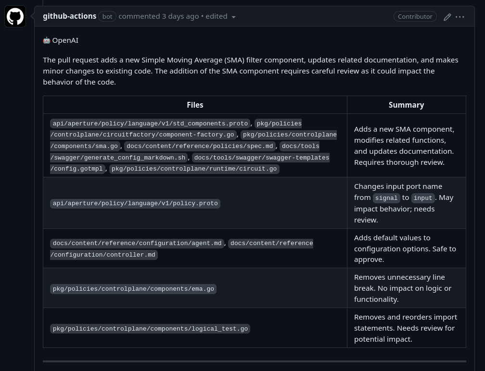
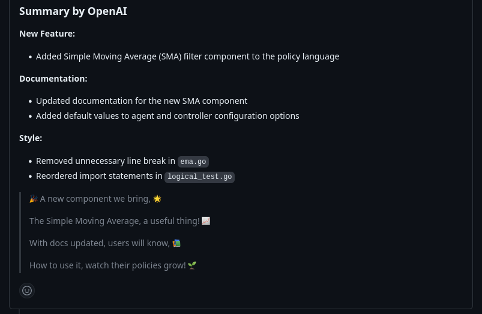
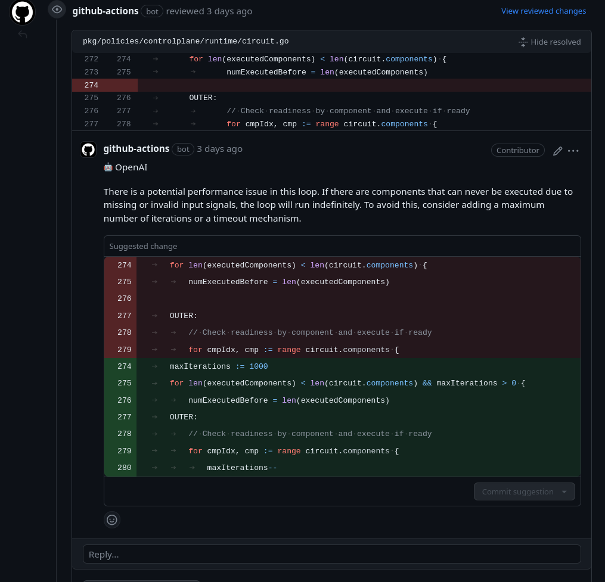
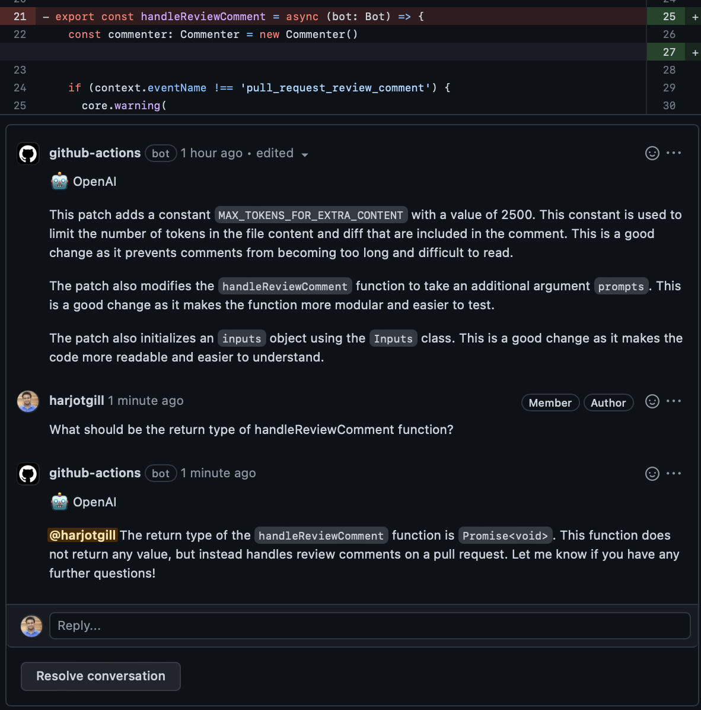

# OpenAI GPT based PR reviewer and summarizer


## Overview

This [OpenAI Chat](https://platform.openai.com/docs/guides/chat) based GitHub
Action provides a summary, release notes and review of pull requests. The
prompts have been tuned for a concise response. To prevent excessive
notifications, this action can be configured to skip adding review comments when
the changes look good for the most part.

In addition, this action can also reply to the user comments made on the review
by this action.

NOTES:

- Your code (files, diff, PR title/description) will be sent to OpenAI's servers
  for processing. Please check with your compliance team before using this on
  your private code repositories.
- OpenAI's API is used instead of ChatGPT session on their portal. OpenAI API
  has a
  [more conservative data usage policy](https://openai.com/policies/api-data-usage-policies)
  compared to their ChatGPT offering.

## Usage

Add the below file to your repository at
`.github/workflows/openai-pr-reviewer.yml`

```yaml
name: Code Review

permissions:
  contents: read
  pull-requests: write

on:
  pull_request:
  pull_request_review_comment:
    types: [created]

concurrency:
  group:
    ${{ github.repository }}-${{ github.event.number || github.head_ref ||
    github.sha }}-${{ github.workflow }}-${{ github.event_name ==
    'pull_request_review_comment' && 'pr_comment' || 'pr' }}
  cancel-in-progress: ${{ github.event_name != 'pull_request_review_comment' }}

jobs:
  review:
    runs-on: ubuntu-latest
    steps:
      - uses: fluxninja/openai-pr-reviewer@main
        env:
          GITHUB_TOKEN: ${{ secrets.GITHUB_TOKEN }}
          OPENAI_API_KEY: ${{ secrets.OPENAI_API_KEY }}
        with:
          debug: false
          review_comment_lgtm: false
```

### Configuration

See also: [./action.yml](./action.yml)

### Conversation with OpenAI

You can reply to a review comment made by this action and get a response based
on the diff context. Additionally, you can invite the bot to a conversation by
mentioning it in the beginning of the comment with `@openai`.

Example:

> @openai Can you please review this block of code?

### Screenshots









#### Environment variables

- `GITHUB_TOKEN`: This should already be available to the GitHub Action
  environment. This is used to add comments to the pull request.
- `OPENAI_API_KEY`: use this to authenticate with OpenAI API. You can get one
  [here](https://platform.openai.com/account/api-keys). Please add this key to
  your GitHub Action secrets.

#### Inputs

- `debug`: Enable debug mode, will show messages and responses between OpenAI
  server in CI logs.
- `max_files`: Maximum number of files to be reviewed. Less than or equal to 0
  means no limit.
- `review_comment_lgtm`: Leave comments even the patch is LGTM
- `path_filters`: Rules to filter files to be reviewed.
- `temperature`: Temperature of the GPT-3 model.
- `system_message`: The message to be sent to OpenAI to start a conversation.

### Prompt templates:

See: [./action.yml](./action.yml)

Any suggestions or pull requests for improving the prompts are highly
appreciated.

## Developing

> First, you'll need to have a reasonably modern version of `node` handy, tested
> with node 16.

Install the dependencies

```bash
$ npm install
```

Build the typescript and package it for distribution

```bash
$ npm run build && npm run package
```

## FAQs

### Review pull request from forks

GitHub Actions limits the access of secrets from forked repositories. To enable
this feature, you need to use the `pull_request_target` event instead of
`pull_request` in your workflow file. Note that with `pull_request_target`, you
need extra configuration to ensure checking out the right commit:

```yaml
name: Code Review

permissions:
  contents: read
  pull-requests: write

on:
  pull_request_target:

jobs:
  review:
    runs-on: ubuntu-latest
    steps:
      - uses: fluxninja/openai-pr-reviewer@main
        env:
          GITHUB_TOKEN: ${{ secrets.GITHUB_TOKEN }}
          OPENAI_API_KEY: ${{ secrets.OPENAI_API_KEY }}
        with:
          debug: false
```

See also:
https://docs.github.com/en/actions/using-workflows/events-that-trigger-workflows#pull_request_target

### Inspect the messages between OpenAI server

Set `debug: true` in the workflow file to enable debug mode, which will show the
messages
